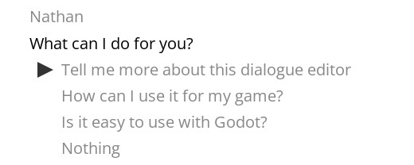
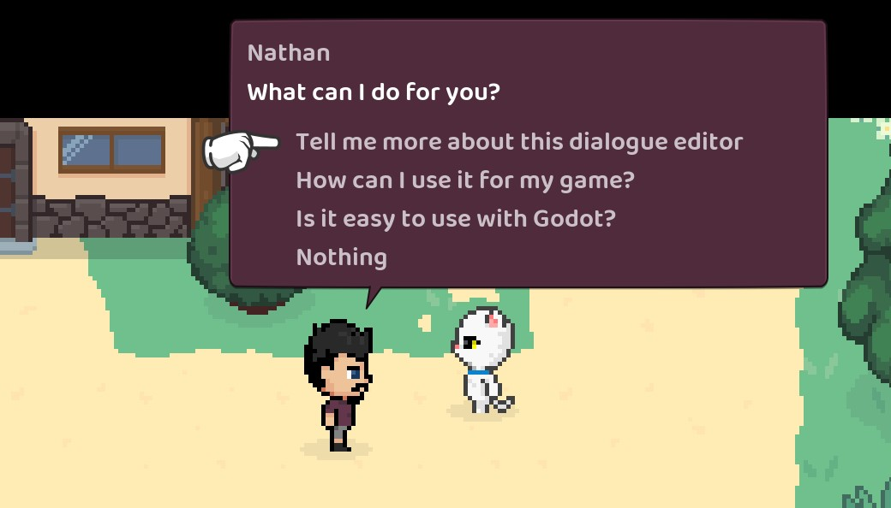

# 在游戏中使用对话

全局调用`DialogueManager`可用于提供对话行。

如果您没有在[编辑器](Settings.md)中指定游戏状态，您可以手动设置它们，例如：

```gdscript
# Game state objects are globals that have properties and methods used by your dialogue
DialogueManager.game_states = [GameState, SessionState]
```

`get_next_dialogue_line`然后，您可以通过屈服并提供节点标题来获得一行对话。

因此，假设您的对话文件是`res://assets/dialogue/example.tres`并且您在其中有一个节点标题，`~ some_node_title`那么您可以这样做以获得第一个可打印的对话：

```gdscript
var dialogue_resource = preload("res://assets/dialogue/example.tres")
var dialogue_line = yield(DialogueManager.get_next_dialogue_line("some_node_title", dialogue_resource), "completed")
```

您也可以`get_next_dialogue_line`直接调用资源（这只是调用全局的快捷方式）：

```gdscript
var dialogue_resource = preload("res://assets/dialogue/example.tres")
var dialogue_line = yield(dialogue_resource.get_next_dialogue_line("some_node_title"), "completed")
```

这将找到具有给定标题的行，然后开始检查条件并遍历`next_id`序列中的每一行，直到我们遇到可以显示的对话行（或对话结束）。沿途发现的任何突变也将被执行。

你需要`yield`这个电话，因为它不能保证立即返回。如果有任何突变，则需要让它们在找到下一行之前运行。

对话中返回的行是 a`DialogueLine`并且将具有以下属性：

- **字符**：字符串
- **对话**：字符串
- **翻译键**：字符串
- **替换**：数组{表达式，value_in_text}字典（表达式是AST格式，可以手动解析`DialogueManager.replace_values()`）
- **pauses** : { index => time } 的字典
- **速度**：[索引，速度]的数组
- **inline_mutations** : [index, expression] 数组（表达式为 AST 格式，可以使用 手动解析`DialogueManager.mutate()`）
- **next_id** : 字符串
- **time** : null or String ("auto" or float-like string)
- **响应**：DialogueResponse 数组：
  - **字符**：字符串
  - **character_replacements** : Array { expression, value_in_text } 字典（表达式为 AST 格式，可以手动解析`DialogueManager.replace_values()`）
  - **提示**：字符串
  - **is_allowed** : 字符串
  - **替换**：数组{表达式，value_in_text}字典（表达式是AST格式，可以手动解析`DialogueManager.replace_values()`）
  - **翻译键**：字符串
  - **next_id** : 字符串

现在您有了一行对话，您可以在它之后找到下一行：

```gdscript
# If this line has no responses we can just use "next_id". If it does have responses you can use
# the "next_id" of whichever response was chosen
dialogue_line = yield(DialogueManager.get_next_dialogue_line(dialogue_line.next_id, dialogue_resource), "completed")
```

由您来实现实际的对话渲染和输入控制，但其中包括一些可以帮助您入门的东西：`DialogueLabel`以及**Example Balloon**。

## DialogueLabel 节点

该插件提供了一个`DialogueLabel`节点（RichTextLabel 节点的扩展），它有助于渲染一行对话文本。

这个节点有一个`DialogueLine`对象（上面提到过），并使用它的属性来计算如何处理输入对话。它将自动处理任何`bb_code`, `wait`,`speed`和`inline_mutation`引用。

用于`type_out()`开始输入文本。`finished`标签在完成输入后会发出一个信号。

当输入暂停时，标签将发出一个`paused`信号（连同暂停的持续时间`spoke`），当一个字母刚刚输入时，将发出一个信号（连同输入的字母和当前速度）。

## 示例气球

有一个对话气球的示例实现，您可以使用它来开始（它与您从对话编辑器运行测试场景时使用的气球相同）。

看看[/addons/dialogue_manager/example_balloon](../addons/dialogue_manager/example_balloon)看看它是如何组合在一起的。

您可以通过执行以下操作让气球在您的游戏中一展身手：

```gdscript
var dialogue_resource = preload("res://assets/dialogue/example.tres")
DialogueManager.show_example_dialogue_balloon("Some title", dialogue_resource)
```

这将在屏幕底部添加一个 CanvasLayer 和一些 UI，以形成一个交互式对话气球。输入映射到`ui_up`、`ui_down`和`ui_accept`。



制作示例气球目录的副本以开始对其进行自定义以适合您自己的游戏。

一旦你有了自己的气球场景，你就可以做这样的事情（这就是我在我的游戏中所拥有的）：

```gdscript
# Start some dialogue from a title, then recursively step through further lines
func show_dialogue(title: String, resource: DialogueResource) -> void:
	var dialogue = yield(DialogueManager.get_next_dialogue_line(title, resource), "completed")
	if dialogue != null:
		var balloon := DialogueBalloon.instance()
		balloon.dialogue = dialogue
		add_child(balloon)
		# Dialogue might have response options so we have to wait and see
		# what the player chose. "actioned" is emitted and passes the "next_id"
		# once the player has made their choice.
		show_dialogue(yield(balloon, "actioned"), resource)
```



为了实现与上述示例类似的效果（将自身定位在角色附近的气球），我建议您将气球控件设置为 a `Node2D`，然后您可以将其移动到角色的`global_position`. 此外，在每个“可交谈”字符中，我都有一个`Position2D`节点，用于计算引脚的位置。

## 条件

条件允许您选择显示对话或响应选项。

如果您在对话编辑器中有一个条件，例如`if some_variable == 1`or那么您需要在给定的 s 或当前场景`if some_other_variable`之一上具有匹配的属性。`game_state`

如果您有类似的情况，`if has_item("rubber_chicken")`您将需要一个`game_state`与签名匹配的 s 或当前场景的方法（只要类型匹配或未键入，`func has_item(thing: String) -> bool:`参数可以随心所欲地调用）。`thing`该方法将`"rubber_chicken"`作为该参数给出）。

## 突变

突变用于更新游戏状态或运行序列（或两者）。

如果您在对话编辑器中有一个突变，`do some_variable = 1`那么您将需要在您`game_state`的其中一个或当前场景上具有匹配的属性。

如果您有类似的突变，`do animate("Character", "cheer")`那么您将需要一个`game_state`与签名匹配的 s 或当前场景的方法`func animate(character: String, animation: String) -> void:`。论据`character`将被给出`"Character"`并且`animation`将被给出`"cheer"`。

## 在运行时生成对话资源

如果您需要`DialogueResource`在运行时构建 a ，您可以使用`get_resource_from_text(string)`：

```gdscript
var resource = DialogueManager.get_resource_from_text("~ title\nCharacter: Hello!)
```

这将通过解析器运行给定的文本。

如果存在语法错误，它们将列在`resource.errors`.

如果没有错误，那么您可以像往常一样使用这个临时资源：

```gdscript
var dialogue = yield(DialogueManager.get_next_dialogue_line("title", resource), "completed")
```