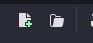
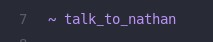
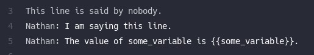
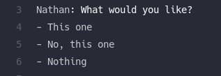
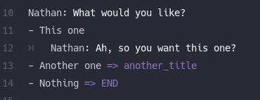
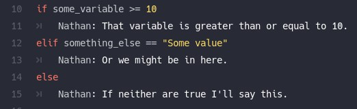
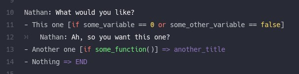
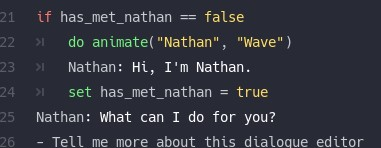
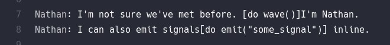
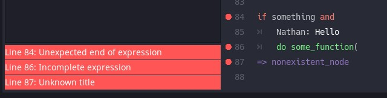

# 写作对话

导航到编辑器中的“对话”选项卡。


通过单击“新建对话文件”按钮或“打开对话”按钮打开一些对话。



## 节点

所有对话都存在于节点内。节点以“~”开头的行开始。



一个节点将继续，直到遇到另一个标题或文件结束。

## 对话

对话行要么只是文本，要么是“角色：他们说什么”的形式。

对话行可以包含包裹在“{{}}”中的**变量**（在角色名称或对话中）。您使用的任何变量都必须是您提供的游戏状态之一的属性或方法（请参阅下面的**设置，运行时**）。



对话行还可以包含RichTextEffects 的**bb_code**（如果您最终使用此插件提供的a`RichTextLabel`或）。`DialogueLabel`

如果您使用`DialogueLabel`节点，那么您也可以使用`[wait=N]`和`[speed=N]`代码。`wait`将暂停输入对话`N`几秒钟（例如，`[wait=1.5]`将暂停 1.5 秒）。`speed`将通过该因素改变当前对话行的打字速度（例如，`[speed=10]`将打字速度改变为比正常速度快 10 倍）。

还有一个`[next]`代码可以用来表示一行应该是自动前进的。如果没有给出任何参数，它将在文本输入后立即自动前进。如果给出类似的`[next=0.5]`内容，它将在输入完成后等待 0.5 秒，然后再移动到下一行。如果给定`[next=auto]`，它将根据行的长度自动等待一段时间。

## 回应

要给玩家分支选项，你可以用“-”开始一行，然后是一个提示。和对话一样，提示也可以包含用`{{}}`.



By default responses will just continue on to the lines below the list when one is chosen.

要进行分支，您可以在给定提示下提供缩进正文，或添加`=> Some title`其中“某些标题”是另一个节点的标题。如果您想立即结束对话，您可以`=> END`。



如果响应提示包含角色名称，那么当玩家选择它时，它将被视为实际的对话行。

例如：

```
Someone: Here is a thing you can do.
- That's good to hear!
    Nathan: That's good to hear!
- That's definitely news
    Nathan: That's definitely news
```

...与写作相同：

```
Someone: Here is a thing you can do
- Nathan: That's good to hear!
- Nathan: That's definitely news
```

## 条件

您可以使用条件块来进一步分支。以“if”开始条件行，然后进行比较。您可以比较变量或函数结果。

附加条件使用“elif”，您可以使用“else”来捕获任何其他情况。



响应也可以有条件。将这些包裹在“[”和“]”中。



如果在响应行上使用条件和 goto，请确保最后提供 goto。

## 突变

您可以使用“set”或“do”行来修改状态。使用的任何变量或函数必须是您提供的游戏状态之一的属性或方法（请参阅下面的**设置，运行时**）。



在上面的示例中，对话管理器希望您的游戏状态之一实现带有签名的方法`func animate(string, string) -> void`。

您还可以使用一些特殊的内置突变：

- `emit(...)`- 在您的游戏状态上发出信号。
- `wait(float)`- 等待`float`几秒钟（内联使用时无效）。
- `debug(...)`- 在输出窗口打印一些东西。

突变也可以内联使用。当输入的对话到达文本中的那个点时，将调用内联突变。



需要注意的一件事是，`yield`不会等待使用的内联突变，因此对话将立即继续。

## 错误检查

运行错误检查应突出显示对话中的任何语法或引用完整性问题。



如果对话资源在运行时有任何错误，它将引发断言失败并告诉您它是哪个文件。

## 运行测试场景

对于不太依赖游戏状态条件的对话，您可以通过单击主工具栏中的“运行测试场景”按钮对其进行快速测试。

这将启动一个测试场景并运行当前活动的节点。使用`ui_up`、`ui_down`和`ui_accept`导航对话和响应。

一旦对话结束，场景将关闭。

## 翻译

您可以从对话编辑器的“翻译”菜单中将翻译导出为 CSV。

这将找到任何独特的对话行或响应提示并将它们添加到列表中。如果为该行指定了一个静态键（例如`[TR:SOME_KEY]`），那么它将用作翻译键，否则对话/提示本身将是。

如果目标 CSV 文件已经存在，它将被合并。