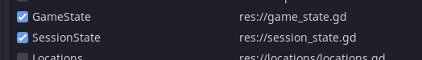

# 设置

## 编辑

**编译器**

- `Check for errors as you type`将在 1 秒不活动后进行语法检查。
- `Store compile results in resource`将允许您关闭预烘焙编译结果。当它关闭时，对话资源将在运行时被解析。
- `Treat missing translations as errors`如果您使用静态翻译键并手动添加它们，则可以启用（有一个自动静态键按钮，但您可能正在编写特定键）。

**编辑**

- `Wrap long lines`打开自动换行。

## 运行

**回应**

- `Include responses with failed conditions`将在附加到给定行的响应列表中包含未通过条件检查的响应。

**游戏状态**

对话运行时本身是无状态的，这意味着它希望您的游戏为变量和运行方法提供值。在运行时，对话管理器将首先检查当前场景，然后检查此处提供的任何全局状态。

例如，我的对话使用了持久性`GameState`和短暂性。`SessionState`

